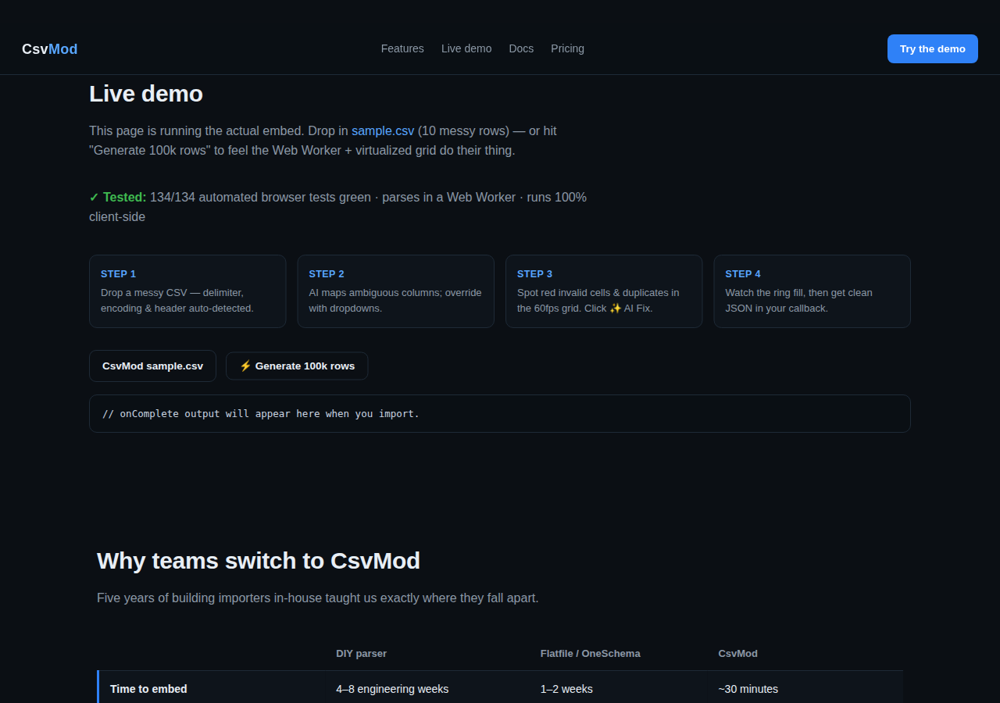
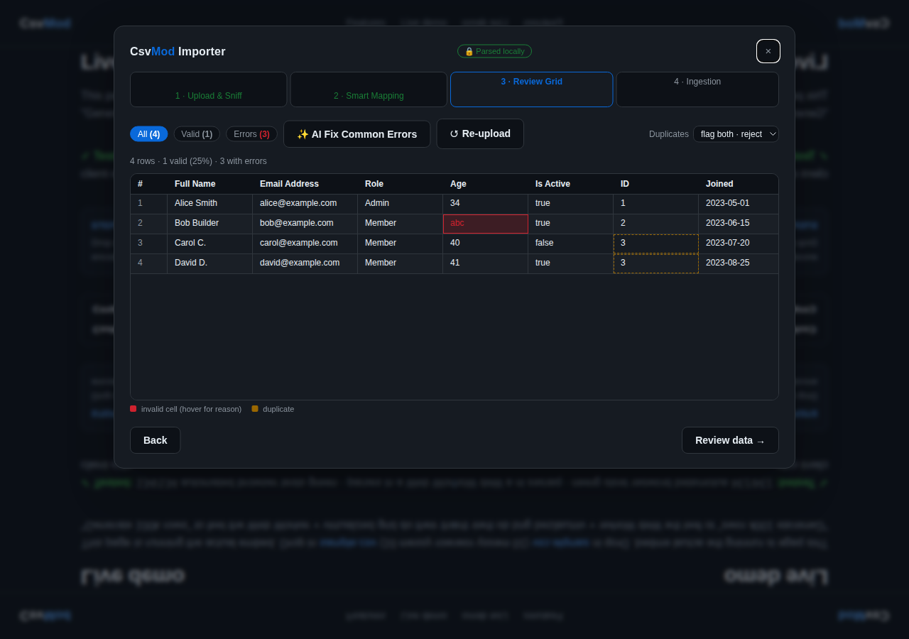
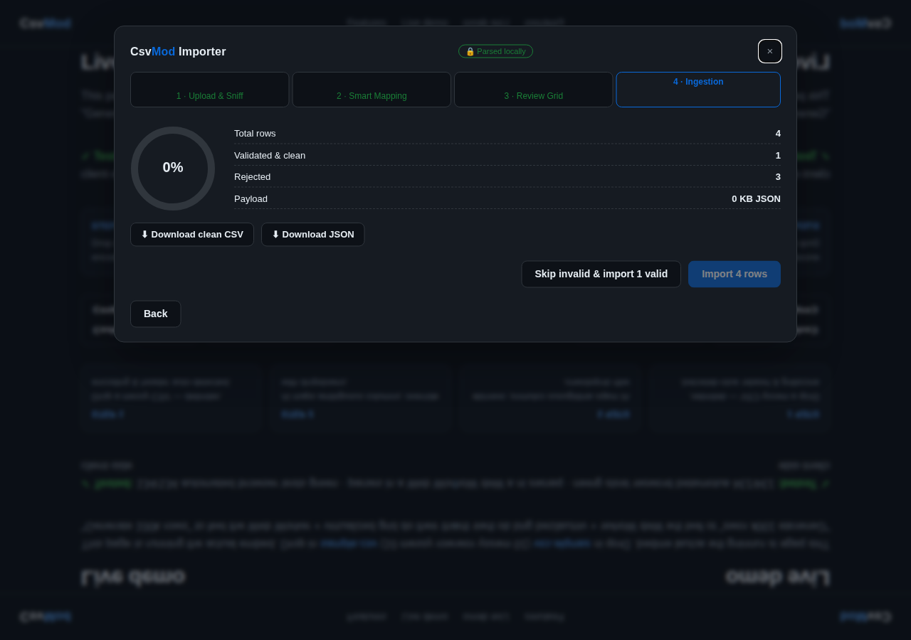
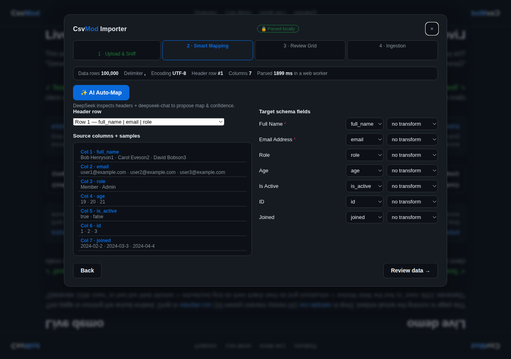

 [](https://csvmod.com)  [](https://rcharris.gumroad.com/l/irlnw)

# CsvMod — embeddable CSV importer

**One `<script>` tag. Messy CSV in. Clean JSON out.**

CsvMod is an embeddable import widget: upload or paste CSV, auto-map columns (DeepSeek AI with a deterministic local fallback), review in a virtualized 60fps grid, and get clean, validated rows in your callback — or POSTed to your webhook.

<<<<<<< HEAD
[Live demo](https://csvmod.com) · [Docs](docs.html) · [Pricing](pricing.html)
=======
[Live demo](https://csvmod.com) · [Docs](docs.html) · [Pricing](pricing.html) · **Buy the full source: [$49 on Gumroad](https://rcharris.gumroad.com/l/irlnw)**
>>>>>>> aab834f (Add Gumroad purchase links to banner + README)

## Screenshots

| Upload & sniff | AI schema mapping | Review grid |
|---|---|---|
|  |  |  |

100k-row Web Worker parse: 

## Quick start

```html
<script src="csvmod.embed.js"></script>
<csvmod-importer
  license-key="pk_demo_..."
  webhook-url="https://your-api.example.com/imports"
  theme="dark"></csvmod-importer>

<script>
  const importer = document.querySelector('csvmod-importer');
  importer.schema = {
    fields: [
      { key: 'email', label: 'Email Address', type: 'email', required: true },
      { key: 'age', label: 'Age', type: 'number' },
      { key: 'id', label: 'ID', type: 'unique' },
      { key: 'joined', label: 'Joined', type: 'date' }
    ]
  };
  importer.onComplete = (result) => {
    console.log(result.validRows);   // clean, validated rows
    console.log(result.rejected);    // count of rows dropped
    console.log(result.meta);        // parse stats, AI flags, source info
  };
</script>
```

Or the SDK form:

```js
const importer = new CSVMod({
  el: '#mount',
  schema: { fields: [...] },
  webhookUrl: '/api/imports',
  onComplete: (result) => { ... }
});
```

## Features

- **Web Worker parsing** — RFC-4180 parser with delimiter/encoding/header-row sniffing. 100k+ rows without blocking the main thread (see the perf test on the [live demo](https://csvmod.com)).
- **Virtualized review grid** — 60fps scrolling, in-cell validation with hover tooltips, duplicate handling (`reject` / `keep-first` / `overwrite`), Valid/Errors filters.
- **AI schema mapping** — DeepSeek zero-shot column mapping with per-field confidence indicators + one-click "AI Fix Common Errors". Falls back to deterministic heuristics when no API key is set.
- **4-step UX** — Upload & sniff → Smart mapping → Review grid → Ingestion (progress ring, webhook POST, `csvmod-complete` event).
- **Templates** — schema presets users can pick on the upload step.
- **Privacy-first** — parsing happens in the browser; a "🔒 Parsed locally" badge is always visible.
- **Theming & branding** — `theme` attribute (auto/light/dark) and `brand` (logo/title/color) config.

## Options

| Property | Type | Notes |
|---|---|---|
| `schema` | `{ fields: [...] }` | Target schema; field types: `string`, `email`, `number`, `boolean`, `date`, `select`, `unique` |
| `webhookUrl` | string | POSTs `{ validRows, rejected, total, meta }` after import |
| `onComplete` | fn | Receives the same payload synchronously |
| `licenseKey` | string | `pk_...` format (demo: `pk_demo_000000000000`) |
| `dupStrategy` | `reject` / `keep-first` / `overwrite` | Duplicate handling (default `reject`) |
| `templates` | array | `[{ id, label, fields }]` presets shown on upload |
| `theme` | `auto` / `light` / `dark` | Appearance |
| `brand` | `{ logo, color, title }` | Header branding |

## Methods & events

- `open()` / `close()` / `reset()` / `ingestString(csv)` / `ingestFile(file)`
- `csvmod-complete` — dispatched with `{ detail: { validRows, rejected, total, meta } }`
- `CsvMod.configureAI({ apiKey, baseURL, model })` — enables AI mapping/fix (omit for the local fallback)

## Development

```
python3 -m http.server 8000   # serve the repo root
# open http://localhost:8000/index.html
```

Browser test suite (Playwright) covers the wizard flow, edge cases, API, DnD,
performance, and accessibility. **134/134 green.**

## License

MIT
